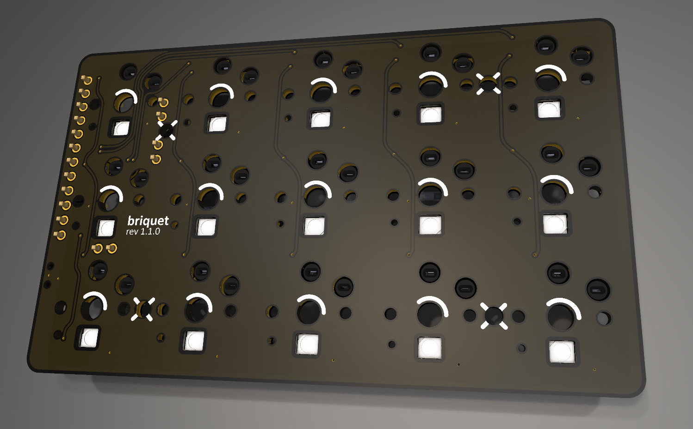
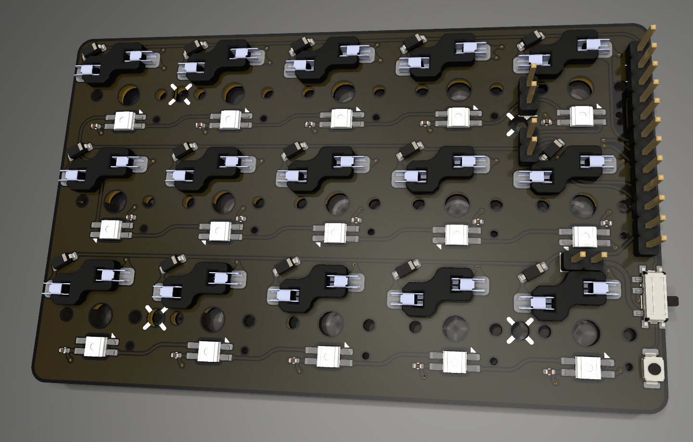

# Briquet
This is a small footprint wireless 30% keyboard.  
The default layout aims to be very consistent to a querty layout.  

# Configuration
You can clone this repository and authorize it on:  
https://nickcoutsos.github.io/keymap-editor/  
Once u save the firmware and keymap render will automatically be built for you.  

# PCB Renders

# Default keymap
